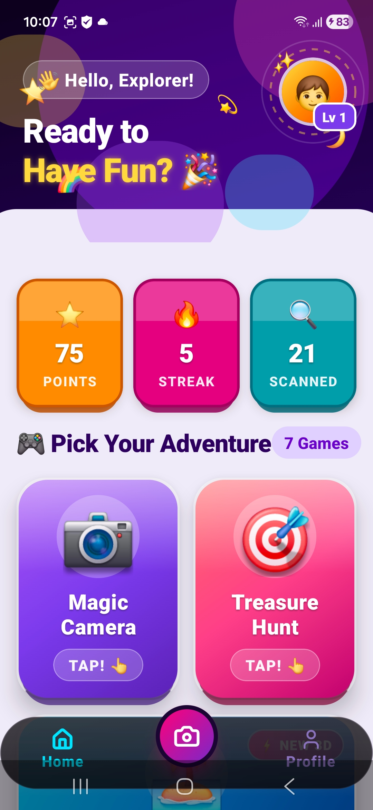
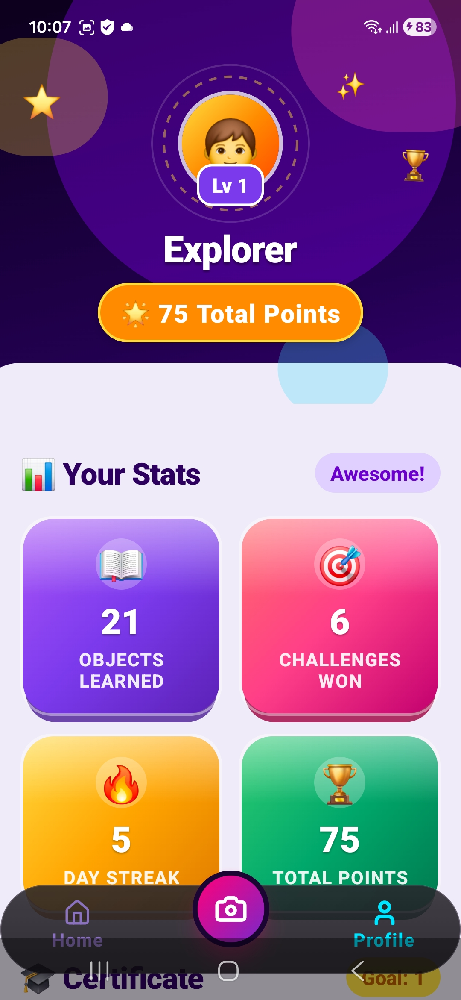
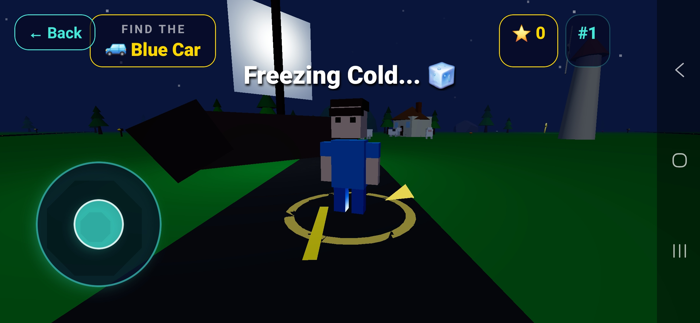
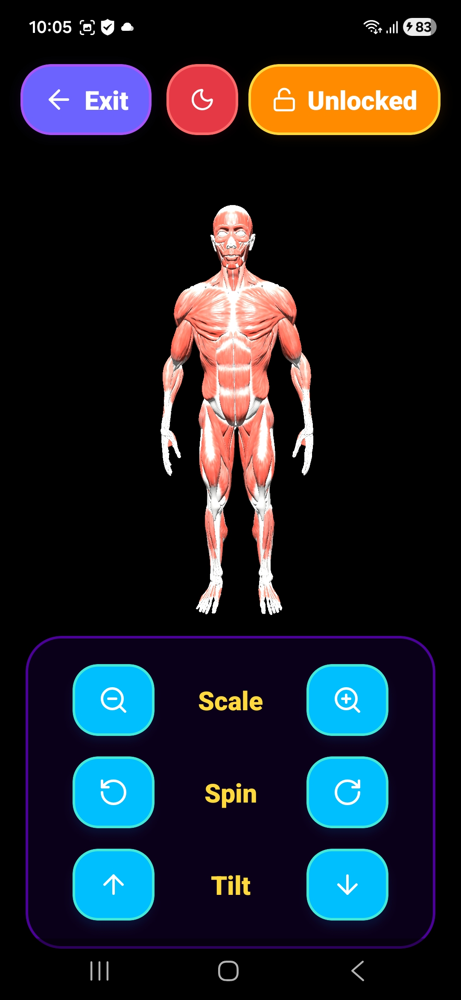
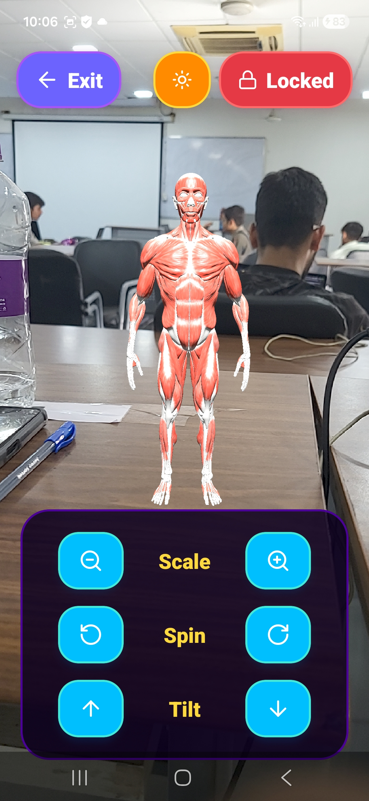

# SharpMind - AR & AI Learning Platform

An integrated, gamified educational suite featuring real-time AI Object Detection, Voice-Coach capabilities, and Immersive 3D AR learning modules tailored for intuitive discovery.

<p align="center">
  
  
  
</p>

**React Native** • **Expo** • **FastAPI** • **ViroReact** • **Python**

[Features](#-key-features) • [Installation](#-installation--setup) • [Architecture](#-priority-subsystems-the-core-application) 

---

## 🚀 Priority Subsystems: The Core Application

The absolute core of this repository orchestrates a gamified, sensory-rich mobile application mapped directly to physical learning concepts.

#### 1. React Native Expo Mobile App
*Directory: `frontend/`*  
*Description:* A high-performance spatial UI utilizing Expo Router. It features bouncy physics, deep-space visual aesthetics, and dynamic navigation integrating directly with the device's native hardware (Camera, Microphone, PDF renderer).

#### 2. ViroReact AR Engine
*Directory: `frontend/app/ar-viewer.tsx`*  
*Description:* Exposes immersive Augmented Reality via `ViroReact` and WebGL. Allows the user to spawn, rotate, tilt, and interact with complex 3D GLB models perfectly blended into the physical world.

<p align="center">
  
  
</p>

#### 3. FastAPI Intelligence Server
*Directory: `backend/`*  
*Description:* A fully standalone Python-based inference and state engine. It handles database state, dynamic streaks, user stat syncing, and offloads computer vision/object bounding logic for our "Treasure Hunt" tasks.

---

## 🖼️ The SharpMind Workspace (Visual UI Platform)

Alongside the AI functionality, SharpMind acts as a premium gamified application with stunning tactile design.

1. **"Magic Camera" & Treasure Hunt (Object Detection)**
   Modular toolkit interface hooked into Expo Camera. It challenges users to find real-world objects in their environment, utilizing object classification to grant points instantly.
   <br/><br/>
   <video autoplay loop muted controls src="./assets/object_detection.mp4" width="100%"></video>

2. **Immersive Dashboard**
   A unified space-themed `(tabs)/index.tsx` screen combining dynamic stat tracking, bouncing layout physics, and floating emoji geometries to reward user progression.
   
3. **Vocab Voice Coach**
   Speech-synthesis and voice recognition levels (`vocab_levels.tsx`). Evaluates phonetic input to actively coach language proficiency.

4. **Dynamic PDF Certificate Generator**
   Tracks milestones dynamically. At full completion, it securely generates an authentic, landscape A4 PDF Certificate entirely natively using HTML-to-PDF (`expo-print`) adorned with gold seals and signatures.

---

## 🎯 System Overview

The SharpMind Platform pushes boundaries on two fronts:
1. **Interactive Media:** Employs advanced hardware integrations mapping 3D objects to real physical space via AR, coupled seamlessly with semantic Voice understanding.
2. **Gamified Progression:** Consolidates learning metrics, beautiful UI components, streak mechanics, and dynamic prize shops into an elegant "3D Toy" spatial design system.

---

## 🌟 Key Features

* **Real-time Object Detection:** Connects via camera to instantly recognize physical realm items to teach vocabulary dynamically.
* **3D AR Magic:** Disconnects from flat screens to serve high-grade `.glb` models overlaid straight onto reality utilizing `ViroReact` skyboxes and ambient lighting.
* **Beautiful Spatial UI:** Uses `LinearGradient`, standard physics interpolations (`react-native-reanimated`, `Animated.spring`), and blur views to render a sleek, glassmorphic space theme.
* **Zero-Cloud Certificate Export:** Automatically constructs perfectly-styled DOM nodes and leverages native Share Sheets to print/save Certificates of Completion locally.
* **Prize Shop & Streak Economy:** Motivates daily app opens by securely tallying streaks, awarding total points, and opening customizable app prize menus.

---

## 🚀 Installation & Setup

### Prerequisites
* **NodeJS 18+** (For Expo React Native Frontend)
* **Python 3.10+** (For FastAPI Backend)
* **Expo Go** app on physical mobile device (Or iOS Simulator / Android Emulator).

### 1. The Intelligence Backend
```bash
cd backend
python -m venv venv
source venv/Scripts/activate  # On Windows: venv\Scripts\activate
pip install -r requirements.txt

# Starts FastAPI backend mapped to port 8000
uvicorn main:app --reload --host 0.0.0.0 --port 8000
```

### 2. SharpMind Platform (Frontend Mobile App)
```bash
cd frontend
npm install
# Start the Metro Bundler
npx expo start
```
*The terminal will output a QR code. Scan it using your phone's Camera (iOS) or the Expo Go App (Android) to launch the app.*

---

## 🤖 Architectures & Technologies

| Concept / Library | Purpose | Framework |
| :--- | :--- | :--- |
| **FastAPI** | Fast, State Backend API | Python |
| **Expo / React Native** | Native App Compilation & UI | TypeScript |
| **ViroReact** | Augmented Reality Scene Rendering | Native iOS/Android |
| **Expo-Print** | Offline PDF Certificate Generation | Node.js |
| **React Native Animated** | Physics & Micro-interactions | JavaScript |

---

## 📜 Licenses & Attribution

- **UI Architecture:** Custom "Deep Space 3D Toy" aesthetic built exclusively for optimal kid-friendly learning UX.
- **Dependencies:** React Native (MIT), FastAPI (MIT), ViroReact (MIT).
- **Authors:** [@P47Parzival](https://github.com/P47Parzival) (Dhruv Mali) & [@siddhant4357](https://github.com/siddhant4357) (Siddhant Sankesara).
